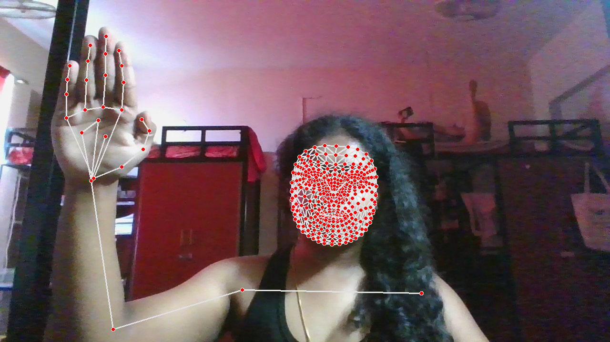

# SignLanguageActionDetection

This repository contains the code and resources for the **SignLanguageActionDetection** project, a machine learning-based system designed to detect and classify sign language actions from video input. The project focuses on recognizing gestures such as "hello," "thanks," and "iloveyou," enabling applications that enhance communication accessibility for the hearing-impaired and integrate sign language into interactive systems.

## Key Features
- **Real-Time Gesture Recognition**: Processes video frames to detect and classify sign language actions in real time.
- **Landmark Extraction**: Uses MediaPipe to extract keypoints from face, pose, and hand landmarks for robust feature representation.
- **LSTM-Based Classification**: Employs a Long Short-Term Memory (LSTM) neural network to classify sequences of keypoints into predefined actions.
- **Scalable Data Collection**: Supports structured collection of video sequences for training and testing.

## Technologies Used
- **OpenCV**: For video capture and image processing.
- **MediaPipe**: For detecting and extracting landmarks from video frames.
- **TensorFlow/Keras**: For building and training the LSTM-based model.
- **Google Colab**: Optimized for execution in a Colab environment with GPU support.
- **NumPy**: For efficient data manipulation and storage of keypoints.

## Setup Instructions
1. **Clone the Repository**:
   ```bash
   git clone https://github.com/Sivaraghavi/SignLanguageActionDetection.git
   cd SignLanguageActionDetection
   ```
2. **Install Dependencies**:
   Install the required Python libraries in your environment or Colab:
   ```bash
   pip install mediapipe opencv-python-headless tensorflow
   ```
3. **Run in Google Colab**:
   - Open Google Colab and upload the `SignLanguageActionDetection.ipynb` notebook.
   - Upload a video file (e.g., `WIN_20240422_10_56_53_Pro.mp4`) or use a webcam for real-time capture.
   - Execute the notebook cells to perform data collection, train the model, and test the system.

## Data Collection and Preprocessing
- **Actions**: Detects three sign language gestures: "hello," "thanks," and "iloveyou."
- **Sequences**: Collects 30 video sequences per action, each containing 30 frames.
- **Keypoint Extraction**: Extracts keypoints using MediaPipe:
  - Pose: 33 keypoints × 4 features (x, y, z, visibility).
  - Face: 468 keypoints × 3 features (x, y, z).
  - Left Hand: 21 keypoints × 3 features (x, y, z).
  - Right Hand: 21 keypoints × 3 features (x, y, z).
- **Data Storage**: Keypoints are saved as NumPy arrays in the `MP_Data` directory:
  ```
  MP_Data/
  ├── hello/
  │   ├── 0/
  │   │   ├── 0.npy
  │   │   ├── 1.npy
  │   │   └── ...
  │   └── ...
  ├── thanks/
  └── iloveyou/
  ```
 
## Model Architecture
The system uses an **LSTM-based neural network** for sequence classification:
- **Input**: Sequences of keypoints from 30-frame video clips (shape: 30 × 1662).
- **Layers**:
  - Multiple LSTM layers to capture temporal dependencies in gesture sequences.
  - Dense layers with softmax activation for multi-class classification.
- **Output**: Classifies input sequences into one of three actions: "hello," "thanks," or "iloveyou."
- **Training**: Trained on labeled sequences with a train-test split (95% train, 5% test).

## Results
- **Accuracy**: Achieves promising accuracy on the test set (specific metrics to be updated after evaluation).
- **Evaluation**: Uses multilabel confusion matrix and accuracy score to assess model performance.
- **Real-Time Performance**: Capable of processing video input with low latency in Colab.

## Usage
1. **Data Collection**:
   - Run the data collection section to capture 30 sequences per action using a webcam or video file.
   - Keypoints are automatically saved in the `MP_Data` directory.
2. **Model Training**:
   - Execute the training section to train the LSTM model on collected data.
   - Monitor training progress using TensorBoard (optional).
3. **Testing**:
   - Use the trained model to classify new video inputs in real time or from pre-recorded videos.

## Contribution
Contributions are welcome! To contribute:
- Report bugs or suggest features by opening an issue.
- Submit pull requests with improvements or new features.
- Ensure code follows the project's structure and includes clear documentation.

## License
This project is licensed under the MIT License. See the [LICENSE](LICENSE) file for details.

## Contact
For any questions or feedback, please reach out to us at [sivaraghavi6103@gmail.com](mailto:sivaraghavi6103@gmail.com).
